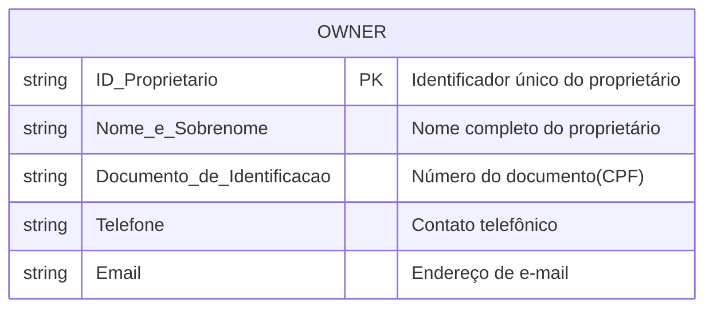

# 🍍 Informações sobre o Projeto

## - Resumo do Processo de Extração e Armazenamento de Dados


## 1. Explicação Geral

Este projeto tem como objetivo consumir o Endpoint **Owner** da API da AVANTIO, processar os dados e armazená-los em um banco de dados PostgreSQL.
O sistema é composto por uma pipeline que realiza a extração de dados a partir do Endpoint da API da AVANTIO, faz o tratamento e o armazenamento desses dados em uma tabela no banco de dados PostgreSQL. A seguir estão detalhados os passos do processo.

## 2. Consumo dos Dados da API

### Classe **API_Owners**

A classe **API_Owners**, localizada no arquivo `./src/API/classes_model.py`, é responsável por realizar as requisições ao Endpoint da API. Ela instância a conexão necessária e executa o processo de extração dos dados.

### Função **request_data**

A função **request_data**, que está localizada em `./src/API/raw_data.py`, realiza a requisição dos dados, obtendo a resposta da API em formato JSON. 

## 3. Tratamento e Ordenamento dos Dados

### Classe **Owners**

A classe **Owners**, que também está em `./src/API/classes_model.py`, instância o objeto `Owner` e contém métodos para manipulação e filtragem dos dados extraídos. Ela organiza e prepara os dados conforme as necessidades do banco de dados.

### Filtragem da Resposta da API

Após a extração dos dados da API, a resposta em JSON é filtrada e organizada na pasta `./src/API/data_model.py`. Aqui, é feito o tratamento dos dados para que estejam prontos para o envio ao banco de dados.

## 4. Criação e Atualização do Banco de Dados

### Conexão e Sessão com o Banco de Dados

Na pasta **Database**, é configurada a conexão com o banco de dados PostgreSQL. A conexão é criada e a sessão é gerida no arquivo `./src/Database/database.py`.

### Modelo do Banco de Dados

O modelo da tabela `Proprietarios` é definido no arquivo `./src/Database/models.py`. Esta tabela é onde os dados dos proprietários serão armazenados no banco de dados.

## 5. Envio dos Dados ao Banco de Dados

Os dados processados e organizados são enviados ao banco de dados no arquivo `./src/Fetch/commit.py`. Este script realiza a inserção ou atualização dos dados na tabela `Proprietarios`.

## 6. Execução do Projeto

O arquivo principal `./src/main.py` é responsável por orquestrar todo o processo. Ao executar o comando:

```bash
python main.py
```

## -🛢️ Esquema do Banco



